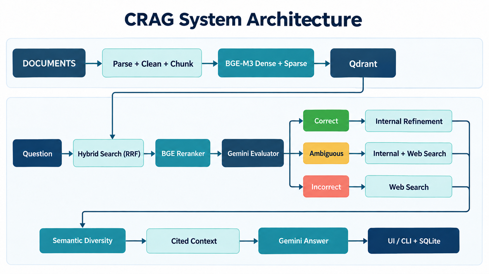

# CRAG System


> A source-aware Corrective Retrieval-Augmented Generation (CRAG) system for document question answering, with hybrid retrieval, three-way knowledge correction, and inspectable citations.

CRAG System ingests PDF, DOCX, Markdown, and text files; indexes dense and sparse representations in Qdrant; and answers questions using evidence selected from the indexed documents and, when needed, fetched web pages. A retrieval evaluator chooses one of three paths: **Correct**, **Incorrect**, or **Ambiguous**. Results expose citations and source metadata for inspection; a citation alone does not prove that an answer is correct.

This is a local research/prototype application, **not a production-hardened or benchmark-validated service**. The current checkout uses Gemini for retrieval evaluation, web-query rewriting, and answer generation. Embedding and reranking run locally.

## Contents

- [CRAG System](#crag-system)
  - [Contents](#contents)
  - [Features](#features)
  - [Architecture](#architecture)
  - [Tech stack](#tech-stack)
  - [Quick start](#quick-start)
    - [Prerequisites](#prerequisites)
    - [Optional: Qdrant server](#optional-qdrant-server)
  - [Usage](#usage)
    - [Reading a result](#reading-a-result)
  - [Project structure](#project-structure)
  - [Validation and tests](#validation-and-tests)
  - [Design decisions and limitations](#design-decisions-and-limitations)
  - [Security and data handling](#security-and-data-handling)
  - [License](#license)

## Features

| Area | Implemented behavior |
| --- | --- |
| Document ingestion | PDF, DOCX, Markdown (including supported CommonMark/GFM constructs), and plain text; parsing, cleaning, structural chunks, source metadata, and content-addressed raw copies |
| Hybrid retrieval | BGE-M3 1024-dimensional dense vectors and lexical sparse weights in Qdrant, combined with reciprocal rank fusion (RRF) |
| Precision | `BAAI/bge-reranker-v2-m3` cross-encoder reranking before evaluation; semantic diversity selection after knowledge refinement |
| Corrective routing | Gemini judges each candidate as relevant, irrelevant, or uncertain; the validated labels determine Correct, Incorrect, or Ambiguous |
| Knowledge correction | Internal knowledge strips for Correct; web search for Incorrect; both sources for Ambiguous where available |
| Grounded answers | Claim-level citation markers validated against selected evidence; explicit partial, insufficient-evidence, and model-abstained states |
| Traceability | Chunk IDs, available page/heading details and offsets, content hashes, Qdrant payloads, and SQLite run checkpoints |
| Local interface | Built-in loopback HTTP API and browser UI with persistent chat sessions, document management, and citation inspection |

## Architecture



1. **Ingestion:** Parsers retain the structure and provenance they can extract. Cleaning normalizes text; the chunker applies length limits and overlap. A pipeline signature and source checksum detect stale indexes.
2. **Retrieval:** BGE-M3 emits dense embeddings and lexical weights. Qdrant searches both named vectors and fuses the results with RRF. A BGE cross-encoder reranks the candidate chunks.
3. **Evaluation:** Gemini returns one relevance label and reason per chunk ID. The application checks the response shape, IDs, and labels before routing; it does not treat the model's answer as an unvalidated confidence score.
4. **Knowledge correction:** Relevant internal chunks become shorter knowledge strips with parent-chunk IDs and offsets. Incorrect/Ambiguous routes rewrite queries with Gemini, search via DDGS/DuckDuckGo, fetch eligible pages, and filter page passages. Search-result snippets are not accepted as evidence.
5. **Context and answer:** A diversity filter reduces overlap among strips. Each selected strip receives a citation marker such as `[1]`. Gemini generates atomic claims; unknown or missing citation markers are rejected. LangGraph manages the three branches, and SQLite stores the run state.

The diversity filter runs **after** retrieval evaluation and knowledge refinement. It does not silently change the chunks sent to the retrieval evaluator. For an Ambiguous result, the context assembler attempts to include both internal and web evidence; missing sources yield a `partial` context with a warning.

## Tech stack

| Component | Technology |
| --- | --- |
| Language/runtime | Python 3.11+ |
| Parsing | `pdfplumber` with `pypdf` fallback, DOCX parser, `markdown-it-py` and plugins |
| Embeddings | `BAAI/bge-m3` via FlagEmbedding |
| Vector database | Qdrant local mode by default; optional Qdrant server |
| Reranker | `BAAI/bge-reranker-v2-m3` |
| Evaluation, rewrite, answer | Gemini API; default model `gemini-3.5-flash-lite` |
| Web knowledge | DDGS/DuckDuckGo and a bounded, safety-checked page fetcher |
| Orchestration and checkpoints | LangGraph + SQLite |
| UI/API | Python HTTP server + HTML/CSS/JavaScript, bound to `127.0.0.1`; SQLite chat sessions |

Qdrant's embedded mode needs no Docker container for the quick start, but its storage should be opened by only one application process at a time. Use Qdrant server when running the UI and separate CLI processes concurrently. The embedding and reranker models are downloaded on first use; plan for their local disk and memory requirements.

## Quick start

### Prerequisites

- Python 3.11 or newer.
- Internet access for the initial model downloads and Gemini requests, and for questions routed to web search.
- A Gemini API key for `evaluate`, `refine`, `search-web`, and `run` (retrieval-only `query` and ingestion do not need one).

The commands below use PowerShell from the repository root. Replace the sample PDF path with a file you own; a `documents/` directory is **not** required.

```powershell
git clone https://github.com/caotranbadat2011/CRAG-System.git
cd CRAG-System
py -3.11 -m venv .venv
.\.venv\Scripts\python.exe -m pip install -e ".[dev]"
```

Set the Gemini key in the current shell without putting it in command history or committing it:

```powershell
$secret = Read-Host "Gemini API key" -AsSecureString
$env:GEMINI_API_KEY = [System.Net.NetworkCredential]::new("", $secret).Password
```

Ingest a file and ask a question:

```powershell
.\.venv\Scripts\python.exe -m crag_ingestion ingest .\path\to\your-file.pdf
.\.venv\Scripts\python.exe -m crag_ingestion list
.\.venv\Scripts\python.exe -m crag_ingestion run "Tài liệu này giải quyết vấn đề gì?" --candidate-limit 10 --limit 3
```

Start the browser UI in a separate terminal, then open <http://127.0.0.1:8000/>:

```powershell
.\.venv\Scripts\python.exe -m crag_ingestion serve --port 8000
```

You can also upload a document directly in the UI. Uploaded sources are stored under `data/uploads/`, then ingested. Do not delete an indexed source file without first removing or replacing that document in the application: queries intentionally reject missing or changed sources.

The browser UI groups questions and cited answers into chat sessions. Use **+ Tạo mới** to start a session, choose an existing session in the sidebar to reopen it after a restart, **Đổi tên** to set a custom title, or **Xóa phiên** to remove its messages. Each assistant message retains its CRAG `run_id` and citation snapshot. Deleting a chat does not delete its saved CRAG runs or indexed documents.

### Optional: Qdrant server

Without `--qdrant-url`, storage is local under `data/qdrant/`. To use an already running Qdrant server, pass its URL as a **global option before the subcommand**:

```powershell
.\.venv\Scripts\python.exe -m crag_ingestion --qdrant-url http://localhost:6333 ingest .\path\to\your-file.pdf
.\.venv\Scripts\python.exe -m crag_ingestion --qdrant-url http://localhost:6333 serve
```

Use the same URL, collection, embedding model, and data directory for ingestion and querying. For a secured Qdrant server, pass `--qdrant-api-key-file` rather than a key on the command line. The default collection is `crag_bge_m3_hybrid`; an incompatible existing collection is rejected, not overwritten.

## Usage

| Command | Purpose |
| --- | --- |
| `ingest PATH` | Index a file or supported files in a directory (`--force` rebuilds an unchanged source) |
| `list` | Show indexed documents and `index_status` |
| `query TEXT` | Inspect hybrid/RRF retrieval; add `--rerank` for cross-encoder scores |
| `evaluate TEXT` | Rerank candidates, label them, and inspect the selected CRAG branch |
| `refine TEXT` | Evaluate and produce internal knowledge strips |
| `search-web TEXT` | Evaluate, search/fetch web sources where needed, and filter web knowledge |
| `run TEXT` | Execute the full three-branch workflow and generate a cited answer |
| `show-run RUN_ID` | Read a saved SQLite result without rerunning retrieval or calling APIs |
| `serve` | Start the local browser UI/API |
| `validate` | Check index, vectors, artifacts, and provenance invariants |

For example, to scope a question to one indexed document:

```powershell
.\.venv\Scripts\python.exe -m crag_ingestion run "Tóm tắt phần Abstract" --document-id DOCUMENT_ID --candidate-limit 10 --limit 3
```

`--candidate-limit` is the number of hybrid candidates considered for reranking; `--limit` is the number sent to retrieval evaluation. Global settings such as `--evaluator-model`, `--context-max-chars`, and `--web-max-pages` go **before** the subcommand:

```powershell
.\.venv\Scripts\python.exe -m crag_ingestion --web-max-pages 3 --context-max-chars 6000 run "Câu hỏi" --limit 3
```

The UI/API supports document upload, replacement of UI-managed files, refresh, deletion, persistent chat sessions, question answering, completed-run lookup, and original-source links. Chat routes are `GET/POST /api/chats`, `GET/PUT/DELETE /api/chats/{session_id}` (`PUT` accepts `{"title":"..."}`), and `POST /api/chats/{session_id}/messages`. The existing one-shot `POST /api/ask` remains available. State-changing requests require `X-CRAG-Local: 1`; routes that accept a request body expect JSON, while `DELETE` needs no JSON body. The server binds only to loopback and has no user authentication.

### Reading a result

- `decision.action` is `Correct`, `Incorrect`, or `Ambiguous`.
- `status` describes the assembled context: `ready`, `partial`, or `no_evidence`.
- `answer.status` distinguishes `answered`, `partial`, `insufficient_evidence`, and `model_abstained`.
- `citations` map answer markers to a chunk ID or web URL and source metadata. A marker confirms that the cited strip was selected; it is **not** automatic proof that every claim is factually entailed by that strip.
- `warnings` report unavailable/filtered web pages and context limitations without turning search snippets into evidence.

## Project structure

```text
CRAG-System/
├── README.md
├── pyproject.toml              # Package metadata and dependencies
├── docs/
│   └── images/
│       └── crag-architecture.png
├── src/
│   └── crag_ingestion/
│       ├── parsers/             # PDF, DOCX, Markdown, TXT; parser registry
│       ├── embeddings/          # BGE-M3 dense/sparse adapter
│       ├── index/               # Qdrant schema, payloads, hybrid search
│       ├── retrieval/           # Reranking, evaluation, refinement, web,
│       │                        # diversity, context, answer generation
│       ├── static/              # Browser HTML, CSS, JavaScript
│       ├── cleaning.py          # Text normalization
│       ├── chunking.py          # Structure-aware chunks and provenance
│       ├── storage.py           # Raw and processed artifact storage
│       ├── documents.py         # Document upload/refresh/delete lifecycle
│       ├── pipeline.py          # Ingestion and retrieval entry points
│       ├── workflow.py          # LangGraph routing and run checkpoints
│       ├── chat.py              # SQLite chat sessions and messages
│       ├── web.py               # Loopback HTTP API
│       ├── validation.py        # Index and provenance checks
│       └── cli.py               # Command-line interface
├── tests/                       # Parser, retrieval, workflow, API tests
└── data/                        # Created at runtime; ignored by Git
```

Runtime data is separated by purpose:

```text
data/
├── raw/            # Content-addressed source copies and extracted media
├── processed/      # Parsed blocks, chunks, and metadata
├── qdrant/         # Embedded Qdrant storage (without --qdrant-url)
├── checkpoints/    # SQLite run history and chats.sqlite3
└── uploads/        # Sources uploaded through the browser UI
```

`documents/` is not a required runtime directory. Do not treat `data/` as disposable cache: it contains indexed vectors, sources, and saved evidence.

## Validation and tests

```powershell
.\.venv\Scripts\python.exe -m crag_ingestion validate
.\.venv\Scripts\python.exe -m pytest
```

`validate` checks the Qdrant vector schema and dimensions, dense norms, sparse weights, document/chunk counts, stored artifacts, hashes, and provenance including PDF page references. Retrieval separately checks the source checksum and pipeline signature. If parsing, chunking, cleaning, or embedding semantics change, the affected documents must be refreshed or re-ingested; the system blocks queries against stale evidence instead of silently using it.

After updating from a version with the older PDF layout/refinement logic, restart `serve` and use the document **Refresh** action (or rerun `ingest PATH --force`) before asking the same question again. Saved chat answers are historical snapshots and are not rewritten by re-indexing.

Tests exercise the implemented components, but this repository does **not** yet publish a labeled QA benchmark or measured answer-accuracy, latency, or throughput results. The evaluator's labels are not calibrated probabilities and are not a reproduction of the original CRAG paper's trained evaluator.

## Design decisions and limitations

- **Preserve evidence before summarizing:** Internal strips retain their parent chunk ID, page/heading metadata, and offsets within the indexed chunk. Web strips retain URL, fetched-page details, and offsets. Some parser source ranges cannot be narrowed exactly after overlapping chunks are assembled.
- **Bounded context:** Context assembly does not cut a selected strip mid-text: with the default budget of 8 strips / 6,000 characters, a strip that cannot fit is omitted with a warning. Earlier chunking or strip construction can still split long source text. Diversity defaults to relevance weight `0.6` and duplicate threshold `0.85`.
- **PDF extraction is best-effort, without OCR:** Text, layout, tables, positions, and extractable images are processed where available, but multi-column reading order, table structure, and precise source coordinates are not guaranteed. The `pypdf` fallback may provide only page-level positions. Image-only pages are not transcribed, and extracted images are not interpreted for answers. Markdown image OCR is only an injectable hook, not a built-in service.
- **External services can fail:** Gemini quotas/model access and DDGS availability affect evaluation and web branches. Failed web retrieval does not make a search snippet trustworthy evidence.
- **Model judgments can be wrong:** Relevance labels, rewritten queries, and grounded answers still need evaluation against a labeled dataset. Citation-marker validation checks reference integrity, not semantic entailment.
- **Negation safeguard is narrow:** Line breaks alone are not treated as sentence boundaries during knowledge refinement, and answer generation retries or omits claims that plainly reverse a negated predicate in their cited strip. Paraphrases, translations, and other contradictions may escape this check; citation validation is not proof of entailment.
- **Chat history is not retrieval memory:** Sessions persist the conversation and citations, but each new question runs through CRAG independently. Pronoun-based follow-ups may need an explicit subject; prior turns are not silently added to retrieval or Gemini prompts.
- **Local web server only:** Chat requests run the CRAG workflow synchronously and may keep other local API actions waiting. The SQLite checkpoint store, embedded Qdrant's single-process access, and unauthenticated loopback UI are suitable for local testing, not multi-worker public deployment. The browser currently expects JSON API responses; an HTML error page can surface as a JSON parse error instead of a useful server message.

## Security and data handling

The indexed payloads, SQLite checkpoints, and chat history contain questions, answers, document text, and retrieved web evidence. Protect the `data/` directory and define a retention policy for sensitive sources. The `.env` file and runtime data are ignored by Git, but verify the files you commit. Do not put API keys in source code, screenshots, terminal transcripts, or issue reports.

When Gemini is used, the selected passages, questions, and evidence needed by the relevant step are sent to Google's API. Review the provider's data-handling terms before using confidential documents. The web fetcher restricts URLs, redirects, response size, and content type, but these safeguards are **not** a complete sandbox for untrusted pages. Never expose the local UI to the public internet without authentication and additional hardening.

## License

Licensed under the [Apache License 2.0](LICENSE).
